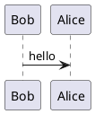

PlantUML text encoding functions
================================ 

**This library exposes [PlantUML text encoding functions](https://plantuml.com/de/pte):**

- `encodep()`
- `encode6bit()`
- `append3bytes()`
- `encode64()`

ℹ️ Usually only **`encodep()`** is used.

[](//packagist.org/packages/jawira/plantuml-encoding)
[](//packagist.org/packages/jawira/plantuml-encoding)
[](//packagist.org/packages/jawira/plantuml-encoding)
[](//packagist.org/packages/jawira/plantuml-encoding)
[](//packagist.org/packages/jawira/plantuml-encoding)
[](https://huboard.com/jawira/plantuml-encoding)

Purpose
-------

[PlantUML](https://plantuml.com/) uses a _special encoding_ to transform an uml text description like 
this:



into this:

```
SyfFKj2rKt3CoKnELR1Io4ZDoSa70000
```

The advantage of the last encoding is that it is easier to use in URL:

<http://www.plantuml.com/plantuml/uml/SyfFKj2rKt3CoKnELR1Io4ZDoSa70000>

Usage
-----

You must import `encodep()` function before using it:

```php
<?php
require './vendor/autoload.php';

use function Jawira\PlantUml\encodep;

$encode = encodep('Alice -> Bob: hello');
echo "http://www.plantuml.com/plantuml/uml/{$encode}";
```

⚠️ Since v1.0.0, `encodep()` function expects to receive an UTF-8 string.

💡 Only PHP >=5.6 allows importing functions, for PHP <=5.5 you have to use 
full function's namespace.

More examples:

- [resources/examples/example-1.php](resources/examples/example-1.php)
- [resources/examples/example-2.php](resources/examples/example-2.php)

Install
-------

```console
$ composer require jawira/plantuml-encoding
```

Contributing
------------

If you liked this project, [⭐ star it on GitHub](https://github.com/jawira/plantuml-encoding).

Credits
-------

These functions are a copy/paste from <http://plantuml.com/code-php>.

***

Packages from jawira
--------------------

<dl>

<dt>
    <a href="https://packagist.org/packages/jawira/plantuml">jawira/plantuml
    </a>
</dt>
<dd>Provides PlantUML executable and plantuml.jar</dd>

<dt>
    <a href="https://packagist.org/packages/jawira/phing-open-task">jawira/phing-open-task
    </a>
</dt>
<dd>Phing task to open files, directories, and URLs with your favorite software.</dd>

<dt>
    <a href="https://packagist.org/packages/jawira/case-converter">jawira/case-converter 
    </a>
</dt>
<dd>Convert strings between 13 naming conventions: Snake case, Camel case,
  Pascal case, Kebab case, Ada case, Train case, Cobol case, Macro case,
  Upper case, Lower case, Sentence case, Title case and Dot notation.
</dd>

<dt>
    <a href="https://packagist.org/packages/jawira/emoji-catalog">jawira/emoji-catalog
    </a>
</dt>
<dd>Get access to +3000 emojis as class constants.</dd>

<dt><a href="https://packagist.org/packages/jawira/">more...</a></dt>
</dl>
